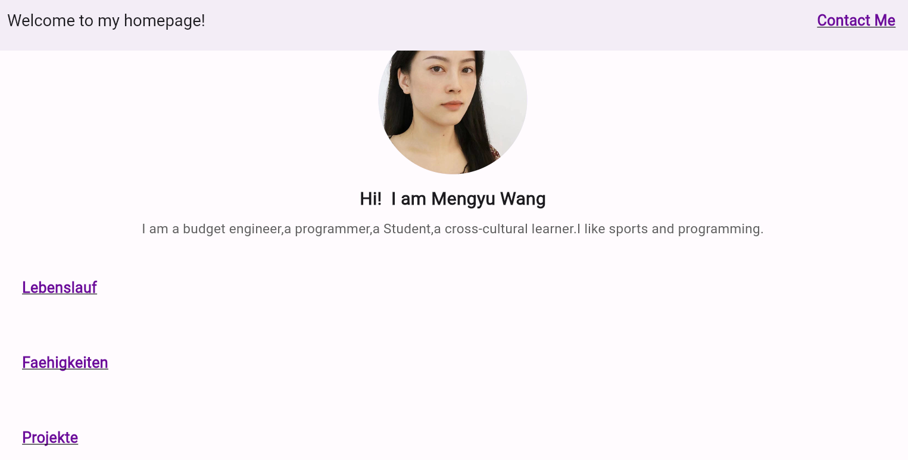
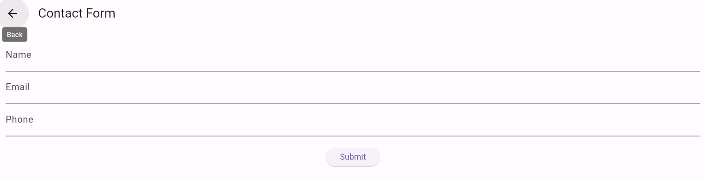

# portfolio_5511026

My first Flutter projekt：GUI-Design.

## About me

- Name: Mengyu Wang

- Matrikelnummer: 5511026

- Email: mengyu.wang@mnd.thm.de

## Aufgabenstellung

1.Gstalten Sie ein Portfolio-App, es sollte die folgende Themen zeigen:

- Startseite: Gestaltet frei eure Seite, die zum Start besucht wird.
- Über mich: Eine kurze Beschreibung über euch, eure Interessen und was euch motiviert.
- Lebenslauf: Eine Übersicht über eure bisherige Ausbildung, berufliche Erfahrungen und wichtige
Projekte.
- Fähigkeiten: Eine Liste oder visuelle Darstellung eurer Fähigkeiten in verschiedenen Bereichen (z.B.
Programmiersprachen, Tools, Soft Skills).
- Projekte: Eine Auswahl von Projekten, an denen ihr gearbeitet habt, inklusive Beschreibungen,
verwendeten Technologien und Links zu Quellcodes, falls vorhanden.

2. Implementierung des Routings
   
- Implementiert eine Navigationsleiste oder ein Menü, das es ermöglicht, zwischen den oben genannten
Seiten zu wechseln. Verwendet dafür Flutter's eingebaute Navigationsmethoden wie Navigator.push()
oder die erweiterten Routing-Funktionen von Flutter.

3. Gestaltung
   
- Achtet auf eine ansprechende Gestaltung der Benutzeroberfläche. Verwendet Material Design
Komponenten und stellt sicher, dass die App auch auf mobilen Geräten gut aussieht.

## Technische Hinweise

Verwendet den MaterialApp-Router für das Routing.
Nutzt ListView, Card, Column und Row Widgets für die Layout-Gestaltung.
Berücksichtigt Barrierefreiheit und Responsive Design.

4. die erstellte Portfolioseite in Google Firebase hosten.

## Firebase URL:https://portfolio-5511026.web.app/

## Meine Benutzeroberflächen siehen so aus

